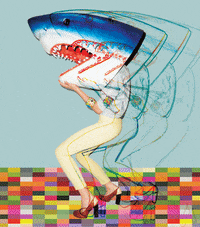

# GIPHY Search



Search for GIFs in a jiffy — or a giffy!

## Getting started

### Enviornment variables

Ensure you add `.env` files to each workspace, using the appropriate `.env.template` file as a base:

```sh
for dir in workspaces/*; do (cd "${dir}" && cp -n .env.template .env); done
```

### Build

```sh
npm run build
```

### Lint

```sh
npm run lint
```

### Test

```sh
npm run test
```

### Develop

```sh
npm run develop
```
